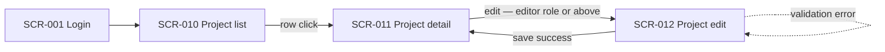
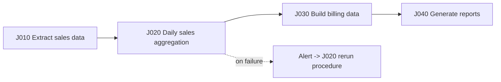

# External Design Deliverables

**Iron rule: never open with hi-fi design. Build agreement stepwise, from coarse granularity to fine.**

External design decides the boundaries where the system meets the outside world — users, other systems, and time — boundaries that are hard to change once exposed. In Japanese contract development this phase is called basic design (基本設計). Make every deliverable serve two roles at once:

1. **Client agreement document** — written at a granularity a non-engineer client can read and review
2. **AI implementation instruction** — written in machine-readable form (Mermaid, tables) so it can be passed straight into an implementing agent's context

Why: separate human-facing and machine-facing documents mean dual maintenance, and dual maintenance always drifts. Keep the state where the exact document the client signed off is the implementation input.

## Scope and adjacent areas

This skill covers **creating, reviewing, and delivering basic-design deliverables centered on screen/UI design and batch design**.

**Out of scope**: API contracts (OpenAPI), data models (ER diagrams, code/ID design), authentication/authorization, and error-response contracts belong to interface contract design and are not covered here. Until a dedicated skill exists, see $backend-patterns for API implementation patterns.

| Adjacent area | Where it goes |
|---|---|
| Requirements definition (feature list, business flows) | → your upstream requirements process |
| Building client agreement, how to present and explain | → your client-communication practice |
| Running design-review meetings | → your design-review process |
| Delivery-document formatting and overall doc structure | → your documentation standards |
| Expanding designs into test perspectives | → $test-design |
| Schedule and acceptance-process management | → your PM/delivery process |
| Designing AI features themselves | → your AI system-design process |
| UI component implementation patterns | → $frontend-patterns |
| Implementation principles (TDD, architecture) | → $best-practices |
| Post-implementation verification | → $verification-loop |

Contract and acceptance clause design is contract territory: basic-design documents are often the acceptance-inspection (検収) target under a fixed-deliverable (請負) contract, and defects can trigger contract non-conformity liability (契約不適合責任). What this skill says about it is practice guidance as of 2026, not legal advice — verify primary sources and leave final judgment to a lawyer.

## Step 1: Confirm inputs and share the deliverable map

Before starting, confirm the requirements-phase outputs exist: feature list, business flows, target roles. If any are missing, send the work back to the requirements process.
Why: drawing screens from vague inputs is imagination, not design.

Share the full deliverable map with the client first:

| Deliverable | Content | Recommended format |
|---|---|---|
| Screen list | Screen ID, name, summary, target roles, URL | Markdown table (git-managed) |
| Screen transition diagram | Transitions and branches between screens | Mermaid flowchart |
| Wireframes | Layout and field placement (lo-fi) | Figma / v0 / HTML prototype |
| Screen spec | Field definitions, input validation, actions, role-based display control, URL parameters | One sheet per screen ID |
| Job list | Job ID, processing summary, trigger, dependencies, rerun policy | Markdown table |
| Job-net diagram | Predecessor/successor relations between jobs | Mermaid flowchart |
| Batch processing spec | Inputs/outputs, unit of work, commit interval, failure behavior, rerun procedure | One sheet per job ID |

## Step 2: Agreement order — screen list → transitions → wireframes → detailed specs

Follow this order and **get client agreement at each stage before moving on**. Do not skip stages.

1. **Screen list** — agree on which screens will and will not be built
2. **Screen transition diagram** — agree on how the screens connect
3. **Wireframes (lo-fi)** — agree on what goes on each screen
4. **Screen specs (detailed)** — fix fields, validations, and behavior

Why: showing hi-fi first derails the discussion into colors and logos and structural agreement never happens. The earlier a coarse-grained agreement lands, the cheaper later changes become.

Do not stop the transition diagram at the happy path. When a screen has many states (modals, tabs, error states), keep a per-screen state list alongside the diagram.
Why: "a transition diagram that only shows the happy path" is a classic source of rework.

## Step 3: Screen design — structure with OOUI

Structure screens around **objects (nouns)**, not tasks (procedures). Enumerate the main business objects and map each to the pattern **object list → detail → actions**.
Why: it reduces screen count and maps cleanly onto CRUD APIs. It is the first choice for business-system screen design.

Checklist:

- [ ] **Assign screen IDs first** (e.g. `SCR-001`) and track every later change and reference by ID
      Why: renaming a screen must not break searchability across the spec set. Screen IDs are the reference key for every downstream design document.
- [ ] Give fields physical names from the start (separate from display labels)
- [ ] Add a **permission-matrix cross-reference column** (role × screen × operation) to the screen spec
      Why: forgetting role-based display control is the classic way screen specs drift from the authorization design. Cross-links make the drift detectable.
- [ ] Write input validation as a set: field, condition, and error message/behavior
- [ ] State URL parameters and initial display conditions explicitly

Screen-list template:

| Screen ID | Screen name | Summary | Target roles | URL | Permission matrix ref |
|---|---|---|---|---|---|
| SCR-010 | Project list | Lists projects in own organization | viewer and above | /projects | PERM-project-view |

## Step 4: Prototypes — fast hi-fi, and "looks ≠ progress"

Once Step 2's structural agreement is in place, you may **rapidly generate a working hi-fi prototype** with tools like v0 — getting lo-fi speed and hi-fi agreement precision at once.
Why: lo-fi alone depends on the client's imagination and leaves the "this isn't what I pictured" risk.

But whenever you show a prototype, **always attach this note**:

> This prototype is a mock-up for reaching agreement. Visual completeness is not implementation progress — data processing, permission control, and error handling are still to be built.

Why: if the client reads "prototype" as "nearly done", schedule expectations collapse and every later negotiation starts from a losing position.

## Step 5: Batch design — job list, job net, idempotency, rerun

Batch is the design of the boundary with **time**. Treat it as the domain where "working is taken for granted, and a failure is a business incident" — monthly billing, daily data feeds.

Job-list template:

| Job ID | Processing summary | Trigger | Window | Depends on (predecessor) | Rerun allowed / method | Error-record handling |
|---|---|---|---|---|---|---|
| J020 | Daily sales aggregation | J010 completion event | 02:00-03:00 | J010 | Yes / rerun from top (idempotent) | Skip and reprocess next day |

Job-net template (chain on completion events, not clock times):

### Idempotency — pick one of three patterns and state it in the spec

Guarantee per job: **running twice with the same business date and parameters produces the same result**.

1. **Status-column pattern** — target records carry a processed flag/status; extract only unprocessed rows
2. **DELETE-INSERT pattern** — delete the output tied to the run unit (business date, transaction ID) before writing
3. **MERGE (UPSERT) pattern** — overwrite on identical keys

Why: an operation where a human eyeballs "did the rerun double-count?" always breaks down eventually.

### Rerun design

- [ ] **Pass the business date as an argument**; never call `now()` inside the processing
      Why: a job that runs under a different date the moment you rerun it the next day is a job that cannot be rerun.
- [ ] Split jobs into the smallest rerunnable units
- [ ] For mid-run failures, state per job whether recovery is resume-from-failed-job or idempotency-backed rerun-from-top
- [ ] Do not launch async jobs from inside a job; keep invocation in the workflow engine
      Why: the engine loses control and the rerun procedure becomes a special case.

### Overrun protection (when a job does not finish inside its window)

- [ ] Duplicate-launch lock (detect and skip a second launch of the same job)
- [ ] Runtime monitoring with threshold alerts
- [ ] Reserve room at design time for splitting and parallelizing the processing
- [ ] Never chain successors on implicit clock assumptions ("it should be done by 3 a.m."); chain on explicit predecessor/successor completion events
      Why: clock-based dependencies always break as data grows. Also watch the data-volume gap between test and production.

## Step 6: Agree failure-time decision criteria with the client in advance

The following are **business decisions belonging to the client**, not technical ones. Interview during external design, document in the spec, and get sign-off:

- [ ] On overrun, which wins: opening online service or finishing the batch (may the batch slip to the next day?)
- [ ] One error stops the whole run, or skip and continue (state per business process, and define downstream handling for skipped records)
- [ ] Incident contacts, escalation order, and which failures may wait until the next business day

Why: leave this vague and, on the night of the incident, the contractor is forced to make the client's business decisions alone. Pre-agreed failure criteria are a design that protects you.

## Step 7: Design review and delivery

Pre-delivery checklist:

- [ ] All deliverables cross-reference by screen ID and job ID (no name-based references remain)
- [ ] Transition diagrams and state lists include failure paths (error states, no-permission views)
- [ ] Permission columns in screen specs match the permission matrix
- [ ] Every job states its idempotency pattern, rerun method, and error-record handling
- [ ] Failure-criteria agreement is recorded (date, who agreed)
- [ ] Mermaid diagrams and tables actually render (never deliver a broken diagram)
- [ ] The agreed version carries a version number; later changes are tracked in a change history
      Why: basic-design documents are often the acceptance target, and insurance against "you said / I said" starts with being able to identify the exact version agreed on.

Run review meetings and format delivery documents according to your own design-review process and documentation standards. Cross-reference and consistency checks are mechanical — good candidates for agent hooks or CI enforcement.

## Division of labor: what AI does / what only humans can decide

| AI (the agent running this skill) does | Only humans can decide |
|---|---|
| Generate wireframes and prototypes | Information architecture (which screens **not** to build) |
| Draft screen list and transition diagrams in Mermaid | Final check of consistency with the business flow |
| Draft field-definition tables for screen specs | Absorbing the client's implicit expectations (habits from legacy systems, organizational context) |
| Draft job definitions and job-net diagrams | Cutoff times and business priorities on overrun |
| Apply idempotency patterns, draft rerun runbooks | The failure-criteria agreement with the client itself |
| Mechanical cross-reference and consistency checks across specs | Acceptance- and contract-related judgment (including consulting professionals) |

Recommended collaboration pattern: **AI drafts three options; a human uses business knowledge to narrow to one and shows that one to the client.**
Why: AI is fast at generating options; narrowing down and building agreement require business context only humans hold.

## Canonical resources

- Manabu Ueno, *Object-Oriented UI Design* (オブジェクト指向UIデザイン, Gijutsu-Hyoronsha) — the canonical OOUI text
- Shozaburo Yoshihara, *Hajimete no Sekkei o Yarinuku Tame no Hon, 2nd ed.* (はじめての設計をやり抜くための本, Shoeisha) — the standard Japanese survey of external-design deliverables
- Future Corporation, "Batch Application Design Guidelines" (future-architect.github.io/arch-guidelines) — the definitive public Japanese guide to idempotency and rerun design
- Digital Agency (Japan) Design System / SmartHR Design System — public Japanese design systems to reference
